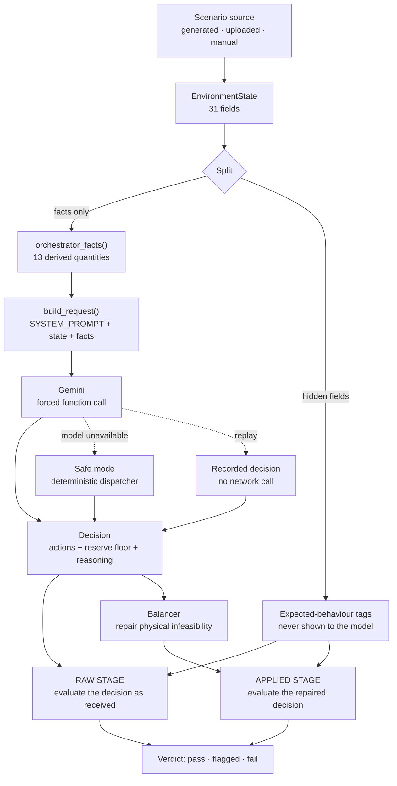

# Architecture

Renewable Energy Orchestrator — ET × Accenture AI Hackathon, Problem 4.

A plant operator makes a dispatch decision every fifteen minutes. This system puts a language model in that seat, surrounds it with deterministic machinery that cannot be talked into anything, and measures the result against criteria that were written down before the measurement ran.

The design question throughout was not "how do we make the agent look good" but "how would we know if it weren't."

---

## 1. Process flow

The three dotted paths matter as much as the solid one. A decision can come from the model, from the deterministic dispatcher when the model is unavailable, or from a recording — and every decision, from any of those three sources, goes through **both** the raw evaluation and the balancer-then-applied evaluation identically (`app/agents/pipeline.py::_evaluate_proposal` is the one function both `run_decision_pipeline` and `reevaluate_stored` share). The evaluator is never told which source produced the decision it's judging.

---

## 2. Components

### 2.1 Scenario source

Three entry points produce the same `EnvironmentState`:

| Source | Used for | Determinism |
|---|---|---|
| **Generator** (`scenario_agent.py`) | Benchmarks, demo presets | Seeded. Same seed, same scenario, always |
| **File input** (`file_input.py`) | Uploaded days (CSV/XLSX) | Content-hashed `run_id`, so re-uploading the same file reuses the same recordings |
| **Manual form** | Exploration, judging | — |

The generator produces six difficulty profiles: `stable_day`, `cloudy_afternoon`, `price_spike`, `multi_failure_cascade`, `surplus_day`, `shortfall_day`.

**The hidden-tag boundary.** Alongside each scenario the generator derives an expected-behaviour tag — the expected reserve-floor band, the expected ladder step, whether an emergency is expected. These fields live in `_HIDDEN_FIELDS` and are passed to the evaluator only. The orchestrator never sees them. `scripts/prompt_audit_live.py` builds several hundred requests and asserts that no expected-behaviour field, no evaluator output and no API key appears in any of them.

For uploaded days, where there is no generator profile to derive from, the expected band is computed from the scenario's own state via `dispatcher.state_volatility_class`, not from a label.

### 2.2 Orchestrator

| | |
|---|---|
| Model | `gemini-3.5-flash-lite` |
| Temperature | 1.0, pinned |
| Calling convention | Forced function call to `submit_decision` — the model cannot reply in prose |
| Retries | Transient 429 and 503 retried with backoff; exhaustion falls through to safe mode |
| One call per decision | No multi-turn loop, no self-correction pass |

**What the model is given:** the scenario state, the declared objective, and thirteen derived physics facts — among them `sellable_surplus_mw`, `max_import_mw`, `min_required_curtailment_mw`, `surplus_after_max_charge_mw`, and per-battery discharge and charge headroom.

**What the model returns:** market action and amount, per-battery action and amount, curtailment by source, a proposed `reserve_floor_pct` with a one-line justification, and free-text reasoning naming which golden rules were binding and which ladder step it used.

**What the model is never given:** the rules it will be judged against, the expected-behaviour tags, or the evaluator's reference calculation.

### 2.3 Balancer

The model's proposal may be physically infeasible — discharging faster than a battery's rate limit, or allocating the same surplus twice. The balancer repairs it deterministically and records every repair with a reason.

- **Phase A**, load unmet: unwind in a fixed order — sale, then curtailment, then (if still short) battery charging.
- **Phase B**, surplus unabsorbed: additional sale up to the transmission limit, then forced curtailment.

The order is asserted directly by test, against the recorded repair sequence rather than the end state, so a reordering cannot pass silently (`tests/test_balancer_unwind_order.py` — note that the real execution order above is sale-then-curtailment, which the test confirms; a stale inline comment in `balancer.py` itself states the reverse and should not be trusted over the test).

### 2.4 Evaluator

Seventeen rules in `run_rules()`, plus one pipeline-level rule (`rule_model_call`) for whether a decision was produced at all. Three-valued: **pass**, **flagged**, **fail**. Any fail makes the decision a fail; otherwise any flag makes it flagged.

| Severity | Rules | What they protect |
|---|---|---|
| **Fail** | 1, 2a, 3, 4, 6, 7, 8a | Reliability, grid stability, curtailment discipline, battery safety |
| **Flagged** | 2b, 3b, 5, 8b, 8c, 8d, 8e, 9, 10, 11 | Objective adherence, floor discipline, repair magnitude |

Rules are evaluated from scenario state and the decision — never from the model's reasoning text. A model that explains itself persuasively scores exactly the same as one that says nothing.

Two rules are objective-gated: `rule_5` is not applicable under `min_carbon` or `max_renewable_utilisation` (those objectives don't trade cost against a price-peak charging decision), and `rule_9` branches on which metric the declared objective's top priority names (cost, carbon, renewable utilisation, or profit).

---

## 3. The decisions the system makes

### 3.1 Golden rules — never traded away

Reliability, grid stability, minimal curtailment, battery protection. These are enforced regardless of declared objective, and a violation is a fail rather than a flag. Reliability and stability outrank the other two: a storm may legitimately force a deep discharge, and that case is logged as an emergency rather than scored as a violation.

### 3.2 Objective cascade

The declared objective reorders what is optimised *beneath* the golden rules.

| Declared | Priority order |
|---|---|
| `cost_efficiency` (default) | cost → carbon → renewable utilisation |
| `min_carbon` | carbon → cost → renewable utilisation |
| `max_renewable_utilisation` | renewable utilisation → cost → carbon |
| `max_profit` | profit → cost → carbon |

A 5% tolerance band (`OBJECTIVE_TOLERANCE_PCT`) governs how `rule_9` scores the declared objective's **top** priority: the decision passes if it's within 5% of the reference-optimal outcome for that one metric, not just at an exact tie. The cascade's second and third priorities are a stated ordering for a human reader of the prompt, not a separately-scored mechanism — no rule evaluates or enforces anything about them; `rule_9` only ever checks the top priority.

### 3.3 Dispatch ladders

| Situation | Order |
|---|---|
| **Surplus** | serve load → charge battery → sell to grid → curtail (last) |
| **Shortfall** | renewables → battery above floor → grid import → below-floor discharge (emergency only) |

Under `max_profit` the surplus ladder branches: sell before charging. This is the one place the declared objective changes the dispatcher's own ordering, and it is measurable — see §6.

The shortfall ladder is deliberately objective-blind. Keeping load served is not something an objective gets to reorder.

### 3.4 Dynamic reserve floor

The slice of battery charge held back for a genuine reliability emergency. The agent proposes it each interval, with a justification naming the signals that drove it.

Code then enforces, rather than trusting:

- clamped to 20–60%,
- may rise by any amount in one interval but fall by at most 10 points,
- every clamp or ramp-limit is recorded and flagged by `rule_8e`.

Expected bands by volatility: calm 20–30%, some volatility 30–45%, heavy volatility 45–60%. A high floor on a calm day is a mistake, and `rule_8c` catches it.

---

## 4. Design decisions, and what each one buys

### 4.1 The evaluator is separate and blind

The orchestrator never sees the rules. This is what makes the pass rate mean anything: the agent cannot optimise for a test it has not read.

### 4.2 Two evaluation stages

Every decision is scored twice: **raw**, the decision as received from its source (model, safe mode, or replay), and **applied**, after the balancer repairs it.

**The raw figure is the one reported.** It is the honest measure of the agent, because the applied figure is partly a measure of the repair machinery. Both are stored on every benchmark row, and the user interface shows both with the raw one labelled as the headline.

### 4.3 Record and replay

Every live call is recorded, keyed on `scenario_hash + prompt_version + model + temperature + sample_index`.

`prompt_version()` hashes the system prompt and the tool schema; `scenario_hash()` hashes the declared objective, the full non-hidden scenario state, and the derived facts together. **Change either and the key changes, so a stale recording fails loudly rather than silently replaying a decision made under different conditions.** This is deliberate: a replay that quietly matched the wrong thing would be worse than no replay at all.

A cache miss is a distinct, named outcome — not a failed decision. The distinction exists because it was once absent, and a prompt change made a shipped demo render as "0 of 96 passed", which is indistinguishable from the agent failing catastrophically.

### 4.4 Safe mode

When the model is unavailable — no key, rejected key, rate limit exhausted — the deterministic dispatcher decides instead, and the evaluator judges that decision live, by the same rules.

The system therefore always produces a judged decision. Which component decided is reported on every result and never silently substituted.

### 4.5 Pre-registration

`evidence/gate.json` and `evidence/exit_tiers.json` were committed **before** the benchmark ran. Thresholds, per-profile targets, and tier definitions, fixed in advance with git timestamps.

`evidence/prompt_freeze.json` records the frozen prompt version, and three tests pin it: one on `prompt_version()`, one on the exact fact key set, one on two reference `scenario_hash` values. An accidental prompt edit fails the test suite in seconds rather than being discovered when recordings stop matching.

---

## 5. Data and state

A decision is evaluated **independently**. There is no multi-tick state engine: `previous_floor_pct` is supplied as an input so the ramp rule can be enforced, not accumulated across a run.

A day — 96 intervals — is a sequence of independent decisions, assembled afterwards by `day_report.py` into cumulative figures and two deterministic baselines.

| Baseline | Question it answers |
|---|---|
| **Same-objective dispatcher** | Does the agent match the deterministic fallback, given the same objective? |
| **Fixed-cost dispatcher** | What does declaring an objective change at all? |

Money is computed per interval: `amount_mw × 0.25 h × price`, with a 5% buy premium and a 5% sell discount off the quoted price (`PRICE_SPREAD_PCT`). Stored energy is valued at the sell price after charge efficiency — a definition whose consequences are documented in `reports/metric_limitations.md`.

---

## 6. How the architecture supports each demonstrated claim

| Claim shown in the demo | Where the architecture provides it | Evidence |
|---|---|---|
| Three components, evaluator blind to what the agent saw | §2.1 hidden-tag boundary; §2.4 | `prompt_audit_live.py`: several hundred requests, zero leaks |
| Golden rules enforced regardless of objective | §3.1; fail-severity rules in §2.4 | `rules.py` |
| A declared objective changes the dispatch | §3.2 cascade; §3.3 surplus-ladder branch | `baseline_divergence_probe.json` — 30 of 31 constructed surplus states diverge, deterministically, no model involved |
| Agent proposes a reserve floor; code enforces bounds | §3.4 | `rule_8a`–`8e` |
| The agent's own proposal is scored before any repair | §4.2 | Raw and applied on every benchmark row |
| Infeasible proposals are repaired deterministically | §2.3 | Unwind order asserted by test against the repair sequence |
| Safe mode takes over when the model is unavailable | §4.4 | `test_safe_mode.py` |
| Any run replays with no API key | §4.3 | 96 of 96, verified three times, from a clean clone |
| Arbitrary day data can be uploaded and scored | §2.1 file input | Content-hashed run ids; `test_file_input.py` |
| Every day is compared against two deterministic baselines | §5 | `day_report.py` |
| Pass marks fixed before the run | §4.5 | `gate.json`, `exit_tiers.json`, committed before `round1` |
| The system detects its own failures | §2.4; §4.3 | 72-case fault-injection matrix in `step6_evidence.json` |

---

## 7. What this architecture does not do

Stated here so the demo is not assessed against capabilities that were never built.

- **No multi-tick state engine.** Decisions are independent; `previous_floor_pct` is an input, not accumulated state.
- **No forecast-error tracking.** Forecasts inform a single decision and are not scored for accuracy over a horizon.
- **No multimodal ingestion.** Structured inputs only.
- **No real grid or market integration.** Prices and transmission limits are simulated.
- **No self-correction loop.** One model call per decision. The balancer repairs infeasibility, but the model is not asked to revise.
- **The agent does not outperform the deterministic dispatcher.** On the identical 72 benchmark scenarios, scored by the same evaluator: 84.7% against 81.9% before repair, tied at 81.9% after, with three hard failures the dispatcher never produces. All three trace to two documented defects, both described in `reports/findings.md`.

That last point is the architecture's own verdict on itself, and the reason the separation in §4.1 and the pre-registration in §4.5 were worth building. Without them we would not know it.
